# Multiplayer syncing: implementation history and current design

Audited on **14 September 2026**, extended on **15 September 2026**, and checked against `multiplayer-squashed` at `68c4a03` on **17 September 2026**; the historical audit baseline is `3ae1677`. This is a source and Git-history audit, not an in-game certification. Dates below use **UTC+08:00**, matching the development timezone. “First implementation” means the earliest relevant code found in the available local Git history, including WIP commits; it does not mean the first working or released version.

The history matters here: `9fae442` on 5 September consolidated the earlier multiplayer work onto upstream main. Reading only the current branch’s introduction commits would incorrectly date much of this work to September. This audit follows the preserved earlier history with `git log --all`, historical file reads, and diffs. Uncommitted experiments cannot be dated from that evidence.

## First implementation order

| Order | Area from your list | First code evidence | Later design milestones |
| --- | --- | --- | --- |
| 1 | **2 — Gold** | **17 Aug**, `24278ea`: gold-sync spike | `427d4ae`, 18 Aug: complete test flow; native whole-menu rewards on 20 Aug |
| 2, together | **2 — Potions; 7 — relic rewards; 8 — card rewards** | **18 Aug**, `058881c`: mirrored rewards and native selection machinery | Concrete relic/potion assignments on 19 Aug; relic RNG redesign on 23 Aug; card RNG redesign on 29 Aug and replica generation on 8 Sep |
| 3 | **5 — Saving** | **18 Aug**, `058881c`: owner-local reward ledgers; **19 Aug**, `55ebefd`: canonical run-data scaffold | Full per-player AP progress in host snapshots on 20 Aug; multiple campaigns on 25 Aug; separate recovery/checkpoint saves on 28 Aug |
| 4, together | **3 — Settings/progress; 4 — lobby joining** | **19 Aug**, `55ebefd`: dedicated lobby contributions and shared/per-player run data | Full progress transport and deltas on 20 Aug; AP Guest relay removed on 28 Aug |
| 5 | **Shops (added area)** | **21 Aug, 16:28**, `072ba20`: local owner shop construction plus synchronized gold loss | Direct-connection cleanup on 28 Aug; current separate AP page and hinting refinements in September |
| 6 | **1 — Rest-site options** | **21 Aug, 17:35**, `a934604`: bespoke multiplayer campfire state/manifest protocol | **23 Aug**, `2a36f1d`: replaced by shared progress + native rest-site construction |
| 7a | **6 — DeathLink** | **24 Aug, 11:01**, `d95193d` | Managed actions at 11:30; host authority on 26 Aug; per-recipient deduplication on 28 Aug; combat-only owner FIFO, native damage and owner-authored actions/sends on 15 Sep |
| 7b | **6 — Progressive Starter** | **24 Aug, 14:01**, `4c651e1` | Same-day fixes; safe action admission; F# transition model on 6 Sep |
| 8 | **10 — Universal buffs → gold** | **24 Aug, 21:18**, `83adfd9` | **29 Aug**, `38974b9`: divide five gold across configured characters |
| 9 | **9 — Bonus Wax Relics** | **8 Sep**, `759a17b`: upstream wax feature; **9 Sep**, `64b01d3`: multiplayer integration | **10 Sep**, `cad9e17`: player-dependent random rankings |

The gold spike already had native multiplayer entry scaffolding. The 19 August lobby date is the first dedicated **AP contribution/launch contract**, rather than the first appearance of a Join button. Similarly, saving has two beginnings: local reward bookkeeping on 18 August and the shared run-save architecture on 19–20 August.

`759a17b` has an author date of 7 September in UTC−04:00, which is **8 September in UTC+08:00**. That explains the apparent one-day discrepancy in some logs.

## The architecture that connects all eleven areas

Three distinct things travel through multiplayer:

1. **AP facts:** settings, received-item progress, used indexes, stable assignments and pending checks. The local AP owner publishes these; the fixed STS host validates ownership/revisions and relays them.
2. **Native gameplay:** reward selections, card picker choices, relic obtains, HP changes and starter transitions. MegaCrit’s synchronizers or host-ordered managed actions execute these on every replica.
3. **Durability:** the fixed STS host saves a native run containing the shared and per-player AP payload. A successful live publication is not itself a disk checkpoint.

“Replica” means one machine’s copy of the entire multiplayer run, including other players’ characters. The local UI can be private while backend reward objects must exist on every machine.

A crucial boundary is **reward construction**, before anybody selects anything. `RewardsSet.GenerateRewardsFor` can replace a native `CardReward`, `GoldReward` or `PotionReward` with an `ArchipelagoReward`. Every replica must enter that hook with matching owner settings and replica-local attempt counters so its reward list has the same shape and order. MegaCrit can synchronize a later selection index only if that index already means the same reward everywhere. The same warning applies to effects such as The Hunt: if Additional Card Reward were re-enabled in multiplayer, the power and its extra `CardReward` would have to appear at the same construction boundary on every replica. It is currently converted to gold with the other universal combat buffs.

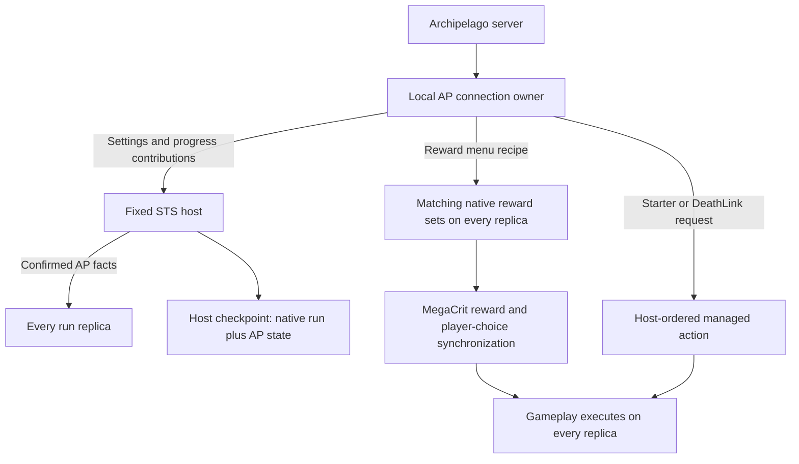

Source: [ApRunData.PublishLocalProgress](/Users/jamsari/PersonalProj/ParallelTasks/Slay-the-Spire-2-Archipelago/client/StS2AP/Multiplayer/ApRunData.cs:368), [ApMirroredRewardDispatcher.OpenMenu](/Users/jamsari/PersonalProj/ParallelTasks/Slay-the-Spire-2-Archipelago/client/StS2AP/Utils/Rewards/ApMirroredRewardDispatcher.cs:160).

## 1. Rest-site options

### Singleplayer → first multiplayer attempt → current design

**Before multiplayer:** `Patches_CampfireSanity.cs` patched `RestSiteOption.Generate`. It read process-global AP settings/progress, looked up campfire locations by character/act/name through the AP session, appended `APRestOption` objects with scout descriptions, and removed Heal/Smith according to progressive unlock levels. A fake resting action prevented a softlock when both were locked. Selecting an AP action sent a check and marked it checked locally.

That was reasonable when the process had one player. In multiplayer, native rest-site construction runs for **every player on every replica**. The process’s own character and slot settings do not necessarily belong to the player whose options are being generated.

**21 August, `a934604`:** introduced a large `RestSiteMultiplayer` protocol. Each owner supplied campfire inputs to the host. Replicas built dense option lists, exchanged semantic manifests, and enabled the UI only after verifying option parity. This carried descriptions, checked state and construction inputs in a rest-site-specific protocol.

**23 August, `2a36f1d`:** deleted that 743-line protocol and the old patch, replacing them with the run-model hook, generic AP option, and existing shared progress infrastructure. `855b90b` on 24 August unified the player-context resolution further. `bb60ee3` tied Mend to Progressive Rest. The unusable-Smith fallback fix appears in `62f24c9` on 28 August and its singleplayer adaptation `d1ffb8c` on 1 September.

### How it works now

`RestSiteOption.Generate(player)` → `ApRestSiteModel.TryModifyRestSiteOptions` → resolve **that player’s** frozen settings and progress → `RestSitePolicy` → native `RestSiteSynchronizer`.

- Singleplayer reads `ArchipelagoClient.Progress`; multiplayer reads the canonical `ApPlayerRunState.Progress` for the owner’s `NetId`.
- Heal and Mend require enough Progressive Rest levels for the act; Smith requires enough Progressive Smith levels.
- The policy adds remaining campfire checks in fixed act/campfire order, using numeric location IDs and the selected AP Player Number.
- It supplies a harmless fallback if both main actions are locked or no native action is enabled. Relic-provided actions remain available.
- MegaCrit sends an **option index**, then executes the indexed option on every replica. Only the check-writing owner queues the AP check and publishes effective check progress; all replicas return native success.
- AP option equality uses **location ID + owner**, preventing multiple generic Filler/Progression options from collapsing into the same hover/index identity. Scout descriptions/icons can remain local presentation.

There is no longer a separate rest-site manifest handshake. Correct per-owner inputs and deterministic list construction are the design’s foundation. If progress cannot be resolved, the hook logs and leaves native options unchanged.

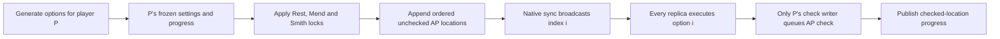

Source: [ApRestSiteModel](/Users/jamsari/PersonalProj/ParallelTasks/Slay-the-Spire-2-Archipelago/client/StS2AP/Models/Singleton/ApRestSiteModel.cs:20), [RestSitePolicy](/Users/jamsari/PersonalProj/ParallelTasks/Slay-the-Spire-2-Archipelago/client/StS2AP/Utils/RestSitePolicy.cs:13), [ApRestSiteOption](/Users/jamsari/PersonalProj/ParallelTasks/Slay-the-Spire-2-Archipelago/client/StS2AP/Entities/RestSite/ApRestSiteOption.cs:68).

## 2. Gold and potions

### Gold

**17 August, `24278ea`:** first spike applied gold locally and called `RewardSynchronizer.SyncLocalObtainedGold`. **18 August, `427d4ae`:** added the aggregate claim dispatcher, source cursor and local test flow. `7be434c` records that the gold test was confirmed working by the developer; this audit did not rerun that test.

The current whole-menu design dates to `8839a14` on 20 August. Gold is represented as a native `GoldReward` within the same mirrored menu as other receipts.

Gold deliberately uses **an aggregate raw-gold cursor**, rather than one selectable object per receipt:

1. Rebuild the raw per-character gold bank from authoritative AP history.
2. Materialize an immutable claim containing source amount, actual grant amount and the raw cursor after redemption. This separates AP accounting from Poverty’s reduction of wallet gain.
3. Send the concrete claim in the menu recipe and build the same native `GoldReward` everywhere.
4. Native selection executes wallet mutation on every replica.
5. Only the local owner calls `CommitGoldClaim`, advances `GoldRedeemed`, and publishes AP progress.

A wallet effect followed by a publication failure invalidates later AP claims; it does not attempt another grant or roll back the gold. The source also records a known edge case: removing Poverty while an already-built menu stays open can leave that offer underpaying.

### Potions

**18 August, `058881c`:** first mirrored potion path used native population on replicas unless an assignment already existed. **19 August, `9b1c64c`:** made the exact potion assignment available before selection for the title, icon and tooltip. **29 August, `32aa30c`:** added owner-final AP-local RNG materialization alongside the older strict replica-native strategy.

Now the owner rolls a potion once with the receipt-local **`potion` RNG domain**, persists it by received item index and publishes its serialized model in the menu. Remote replicas load that exact mutable model; they do not independently roll another potion. Native `PotionReward.OnSelect` handles obtaining it.

Unlike gold, a potion can legitimately return `false` because no slot is available. It remains claimable with the same assignment. Only successful obtain leads to owner-side receipt consumption.

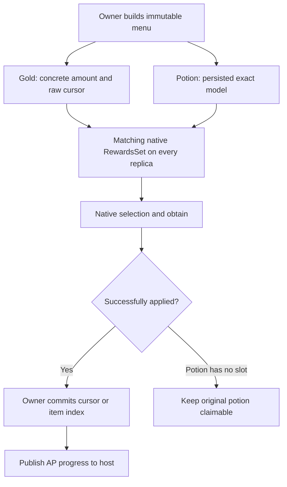

Source: [ApGrantDispatcher](/Users/jamsari/PersonalProj/ParallelTasks/Slay-the-Spire-2-Archipelago/client/StS2AP/Utils/Rewards/ApGrantDispatcher.cs:122), [potion assignment](/Users/jamsari/PersonalProj/ParallelTasks/Slay-the-Spire-2-Archipelago/client/StS2AP/Utils/Rewards/ApMirroredRewardDispatcher.cs:417), [native grant wrappers](/Users/jamsari/PersonalProj/ParallelTasks/Slay-the-Spire-2-Archipelago/client/StS2AP/Utils/Rewards/ApMirroredRewardDispatcher.cs:954).

## 3. Settings and progress

**19 August, `55ebefd`:** introduced shared/per-player run-data contributions. Initially these were a scaffold: run identity, participant mapping, readiness and shared effect facts. **20 August, `3a280c5`:** carried complete per-player AP progress to the host; `dabf523` introduced deltas; `a53a9a7` unified the singleplayer/multiplayer progress representation.

Settings and progress have different lifetimes:

| Data | Author | Lifetime and transport |
| --- | --- | --- |
| `SlotSettings` | Each directly connected AP player | Effective snapshot staged in the lobby and committed into the run |
| `HostSettings`, shared Ascension rules | Fixed STS host | Shared launch contract; saved continuation retains it |
| `Progress` and `ProgressRevision` | Local AP owner | Initial full snapshot, then changed-field deltas through the host |
| `Construction` | Every replica independently | Native reward-generation counters; initialized from checkpoint, not overwritten by live owner progress |

The settings snapshot includes applicable local overrides. In particular, the run freezes relic availability, Ancient mode/pool and DeathLink settings. Presentation preferences are not all global gameplay rules. Current source explicitly makes relic availability and Ancient changes apply to future runs.

`PublishLocalProgress` captures the local AP state, compares it with the last publication, and skips no-change updates. The first update establishes a complete baseline. Later deltas carry `RunId`, `OwnerNetId`, `BaseRevision`, `Revision` and the changed fields.

The host checks that the sender owns the record. Clients accept confirmed updates only from the host. New deltas require the exact baseline and `Revision == BaseRevision + 1`; stale duplicates do not reapply state. A gap is rejected, not automatically repaired. Godot-facing handling is scheduled on the main loop.

Here, **“validate and rebroadcast” does not mean compare or resynchronize the full game state**. Validation is limited to AP protocol integrity: the run ID matches, the network sender owns the `OwnerNetId` record, and the delta is exactly the next revision. The host then stores that current per-player AP view and relays it. MegaCrit still owns synchronization of the concrete reward selection, gold change, relic obtain, HP command or other gameplay operation.

Removing this transport wholesale would currently lose information that the base game cannot infer. Only the connected owner sees asynchronous AP receipt history, checked locations, used receipt indexes and stable AP reward assignments. Other replicas need some of those facts before they independently construct later rest options and native reward objects, while the host needs the current copy for its save. A cleaner base-game-first design can reduce the **breadth** of these deltas feature by feature: express an AP-derived gameplay transition as one native synchronized or managed action, and update the minimal corresponding AP state deterministically inside that action on every replica. Owner-to-host publication remains necessary for AP-server changes and reconnect reconciliation. Once no later constructor reads a broad field, that field can be removed from the rebroadcast payload.

**29 August, `82a72fd`:** separated replica-local construction counters from owner progress. Otherwise, an owner could publish “I have already generated reward number N” while a slower replica still needed to execute that same generation step. Updating its counter from the publication would make it generate N+1 instead. This separation is a key syncing area beyond the initial settings/progress transport.

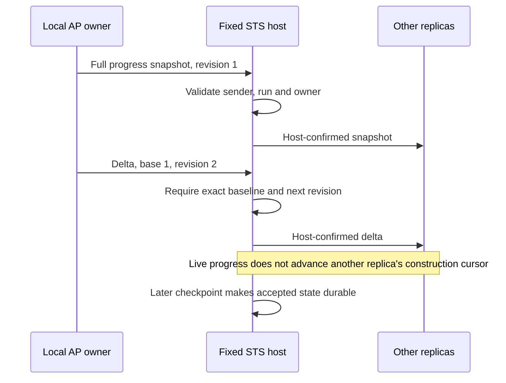

There was also a lobby feedback-loop hazard: staging settings emitted a change event, which refreshed the UI, which staged settings again. `StageHostSettings` now avoids writing an unchanged construction contract. That addresses network/UI starvation; it is distinct from the chest readiness waits.

Source: [snapshot/delta receivers](/Users/jamsari/PersonalProj/ParallelTasks/Slay-the-Spire-2-Archipelago/client/StS2AP/Multiplayer/ApRunData.cs:487), [replica construction state](/Users/jamsari/PersonalProj/ParallelTasks/Slay-the-Spire-2-Archipelago/client/StS2AP/Persistence/ApReplicaConstructionState.cs:5), [effective settings snapshot](/Users/jamsari/PersonalProj/ParallelTasks/Slay-the-Spire-2-Archipelago/client/StS2AP/Multiplayer/MultiplayerSupport.cs:850), [lobby write-loop guard](/Users/jamsari/PersonalProj/ParallelTasks/Slay-the-Spire-2-Archipelago/client/StS2AP/Multiplayer/ApRunData.cs:763).

## 4. Joining the multiplayer lobby

**19 August, `55ebefd`:** implemented the dedicated AP-aware lobby scaffold. **20 August, `3a280c5` and `52e09ca`:** added the AP Guest model and host receipt relay. At that stage there were three roles: Own AP Slot, AP Guest following the host without its own AP connection, and Vanilla Guest.

**28 August, `044ecc6`:** removed AP Guest and its relay. The current roles are **OwnApSlot** and **VanillaGuest**. AP players connect directly, including when several players connect to the same AP slot. Shared-slot numbered-player support came later in `bd5e440` on 6 September, merged by `09800d0` on 7 September.

Current launch flow:

1. Prepare the local AP connection, slot identity, initial receipt history and selected Player Number, or select vanilla guest participation.
2. Hosting requires a prepared AP slot. A disconnected player can still use the native Join flow as a vanilla guest.
3. `ApRunData.StageLocalPlayer` contributes participation, room/team/slot identity, effective settings and receipt readiness under the local native `NetId`.
4. RitsuLib transports a client contribution alongside native character-change messages and flushes it before Ready; the host merges it under sender identity. The host stages its own record locally.
5. The host re-evaluates the **current active roster and contributions** for readiness and again at launch. It requires the fixed host’s AP settings and Ascension contract.
6. Native launch commits that merged run payload. Mid-run progress uses its own transport, not lobby staging.

“Merged run data” is not one flattened settings object. RitsuLib attaches two AP sidecar records to MegaCrit’s normal run payload:

- The **shared host record** contains the schema version, `RunId`, the host’s effective settings, host character offset, configured/current Ascensions, handled Ascension Down receipt indexes and shared standard-relic receipt/chest destinations.
- Each **per-`NetId` record** contains participation kind; AP room/team/slot identity; that owner’s effective `SlotSettings` and Player Number; initial relic receipt indexes and progressive Ancient counts; receipt-source readiness; AP progress/revision; the saved construction baseline; progressive starter state; and wax cadence.

Each AP owner contributes its own per-`NetId` record. The fixed host contributes one of those records for itself **and** the shared record. RitsuLib sends client contributions with native character-change traffic and flushes them before Ready; the host merges each record under the authenticated sender `NetId`. MegaCrit’s character selections, seed, decks, map and ordinary run topology remain native data around the AP sidecar.

Continue-run joining additionally checks the selected saved roster and the returning player’s frozen AP identity. An AP-bound player does not silently become a vanilla guest after an AP disconnect.

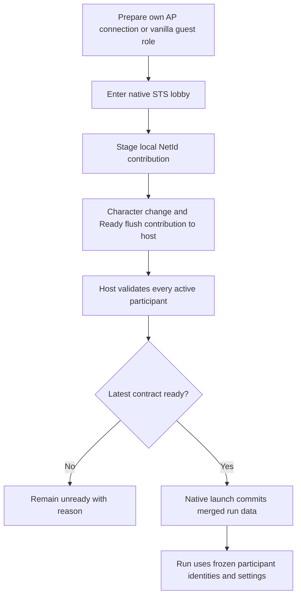

Source: [StageLocalPlayer](/Users/jamsari/PersonalProj/ParallelTasks/Slay-the-Spire-2-Archipelago/client/StS2AP/Multiplayer/ApRunData.cs:94), [host contribution validation](/Users/jamsari/PersonalProj/ParallelTasks/Slay-the-Spire-2-Archipelago/client/StS2AP/Multiplayer/ApRunData.cs:288), [lobby entry/host gates](/Users/jamsari/PersonalProj/ParallelTasks/Slay-the-Spire-2-Archipelago/client/StS2AP/Multiplayer/MultiplayerSupport.cs:523), [continue lobby validation](/Users/jamsari/PersonalProj/ParallelTasks/Slay-the-Spire-2-Archipelago/client/StS2AP/Multiplayer/ApMultiplayerCampaignFlow.cs:103).

## 5. Shops

Shopsanity itself predates the multiplayer branch: `df2ec79` on 1 August introduced the feature. The first dedicated multiplayer implementation is **21 August, `072ba20`**. It changed shop settings and received unlock counts from process-global reads to the local player’s frozen AP state, restricted the AP check page to the local check writer, and synchronized the concrete gold loss through MegaCrit.

The current shop is deliberately asymmetric and therefore simpler than reward menus:

1. MegaCrit rolls the normal `MerchantInventory` once.
2. The local AP owner reads their committed `SlotSettings` and received card/colourless/relic/potion slot unlock counts. These decide which ordinary shop positions remain stocked.
3. For the separate AP page, the mod clones already-rolled merchant entries rather than rolling a second inventory. It replaces their visible models with fake AP check cards/relics/potions backed by the next unchecked `Shop Slot N` locations. The page and free hints are local to the AP check writer.
4. Buying a fake entry does **not** grant the pictured native item. It validates local check ownership, spends gold with `PlayerCmd.LoseGold`, calls `RewardSynchronizer.SyncLocalGoldLost`, queues the AP location check and clears the fake so Courier cannot restock it.
5. The owner’s pending/checked progress later reaches the host through the normal AP progress path. The wallet change already travelled through native synchronization and is present in the host run.

This separation works because the private AP page changes only presentation and which AP location the owner sends. If a shop entry granted a real card, relic or potion, that concrete grant would need the same mirrored/native selection contract as the AP reward menu.

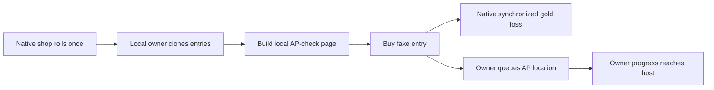

Source: [shop construction and gating](/Users/jamsari/PersonalProj/ParallelTasks/Slay-the-Spire-2-Archipelago/client/StS2AP/Patches/Rooms/Patches_ShopSanity.cs:497), [purchase interception](/Users/jamsari/PersonalProj/ParallelTasks/Slay-the-Spire-2-Archipelago/client/StS2AP/Patches/Rooms/Patches_ShopSanity.cs:657), [local shop ownership rules](/Users/jamsari/PersonalProj/ParallelTasks/Slay-the-Spire-2-Archipelago/client/StS2AP/Multiplayer/MultiplayerSupport.cs:225).

## 6. Multiplayer saving

Your recollection is right about **AP state** moving from player-local storage into the host checkpoint. MegaCrit’s canonical native multiplayer run was already host-owned; the transition was where AP recovery state lived.

### The transition

- **18 August, `058881c`:** owner-local `MultiplayerGrantState` stored assignments and applied reward identities. The gold spike had its own local aggregate ledger.
- **19 August, `f0f39af` / `55ebefd`:** the proposed/scaffolded model kept private owner journals local and only shared AP facts in the native host save. The historical ADR explicitly rejected copying every owner’s full AP journal into the host. That rejection is historical, not current policy.
- **20 August, `3a280c5`:** removed the separate multiplayer gold/grant store classes, introduced full per-player progress in run data, and published owners’ state to the host. `a53a9a7` unified the progress serialization representation shortly afterward.
- **25 August, `d708cae`:** introduced multiple host campaigns instead of one undifferentiated active save. `784587a` on 26 August fixed roster identity.
- **28 August, `044ecc6`:** separated latest native **floor recovery** from the last eligible **AP checkpoint**.

### Current save/continue chain

`RunSaveManager.SaveRun(AbstractRoom)` patch → host-only eligibility → `CaptureLocalHostProgressBeforeSave` → `RunManager.ToSave` with RitsuLib AP payload → `ApMultiplayerCampaignStore.SaveHostSnapshot`.

The save contains the native run, shared AP settings/receipt decisions, and per-player AP state keyed by native `NetId`: frozen identity/settings, progress, revision, assignments, starter state, wax cadence and the host’s construction baseline. “Everything on the host” means **run-scoped recovery data**, not AP credentials or a replacement for the AP server.

The store serializes overlapping save writes with a lock, writes the native snapshot, then associates its campaign copy and metadata. Every native floor save updates recovery; only eligible AP boundaries also update the AP checkpoint. Metadata keeps roster identity and snapshot SHA-256 values. Superseded snapshots are removed when no retained pointer needs them.

On continue, the selected host snapshot supplies the **last exact shared baseline**: native run state plus the AP records that had reached the host when that snapshot succeeded. That AP record can be older than an owner’s server history. Each returning AP owner reconnects, refreshes from the SDK’s complete current received-item/check history, reconciles it against the checkpoint’s used indexes, stable assignments and pending checks, rebuilds derived entitlements such as gold and relic coupons, and republishes the cleaned current view. This prevents a newly delivered receipt from being lost while also preventing a saved consumed receipt from being replayed.

The host therefore holds two time horizons, but not as two AP-only documents. During play, its active `RunState` contains the latest accepted per-owner AP copy in memory. On disk, `FloorRecovery` and `ApCheckpoint` point to retained **full native snapshots**, each with whatever AP payload was current at that save boundary. Live state accepted after the chosen successful checkpoint can disappear in a crash; the AP server can restore authoritative received/check history, but cannot reconstruct lost native RNG or necessarily reproduce a revealed, unsaved concrete reward assignment.

No host migration or distributed save voting is implemented by this design. AP servers retain received/check history, but that alone cannot reconstruct an exact run, revealed card offer or native RNG state after losing the host save.

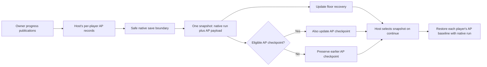

Source: [multiplayer save interception](/Users/jamsari/PersonalProj/ParallelTasks/Slay-the-Spire-2-Archipelago/client/StS2AP/Patches/Lifecycle/Patches_SaveManagement.cs:33), [SaveHostSnapshot](/Users/jamsari/PersonalProj/ParallelTasks/Slay-the-Spire-2-Archipelago/client/StS2AP/Multiplayer/ApMultiplayerCampaignStore.cs:336), [snapshot retention/update](/Users/jamsari/PersonalProj/ParallelTasks/Slay-the-Spire-2-Archipelago/client/StS2AP/Multiplayer/ApMultiplayerCampaignStore.cs:473), [RestoreLocalProgress](/Users/jamsari/PersonalProj/ParallelTasks/Slay-the-Spire-2-Archipelago/client/StS2AP/Multiplayer/ApRunData.cs:341).

## 7. Progressive Starter and DeathLink

Their common structure is **external AP cause → concrete request → safe native action slot → execute on every replica**. They cannot simply mutate a deck/relic/HP on whichever machine received the callback.

### Progressive Starter

First multiplayer code: **24 August, `4c651e1`**, followed by `52a825e` that evening. Later safe-admission fixes include `8a2662b` on 25 August and `7bfd1cb` on 28 August. `5ccfc3f` on 6 September moved transition decisions into an explicit F# state model.

The local owner captures a concrete native starter recipe using **Archaic Tooth** for cards or **Touch of Orobas** for relics: base identity, upgrade identity, serialized base model and serialized upgrading relic. Temporary setup-only cards are cleaned out of the run registry. The recipe is retained for later transitions; other replicas do not independently choose a different mapping.

At new-run initialization or a live relevant receipt, the owner requests a `NonCombat` managed action containing run/action identity, owner/slot, target player, starter kind and target tier. Admission defers it until a safe idle noncombat boundary. Every replica validates and applies the same planned operations: remove the base, restore the base, or grant the native upgrading relic as needed. The applied tier and recipe enter run data with successful intermediate operations recorded. Unsupported character mappings leave the starter unchanged and log the reason.

Receipts for an inactive character remain banked for a later initialization. This is a persisted tier transition, rather than an instruction to blindly obtain another copy on every receipt.

### DeathLink

First code: **24 August, `d95193d` at 11:01**; `ad72a44` changed it to managed actions at 11:30. `3a384ad` on 25 August deferred damage to safe boundaries; `f3a5fae` on 26 August centralized host authorization; `044ecc6` on 28 August added per-recipient AP-event deduplication. On 15 September, `6b32e55` restricted admission to combat and retained distinct events in an owner-local FIFO; `e53f80d` made each AP owner report their own synchronized death; `c8b9532` removed the separate inbound sidecar relay. Damage now uses the native pipeline.

Inbound flow:

1. The AP callback belongs to the local directly connected player and is deferred to the Godot main thread.
2. That owner deduplicates using **recipient NetId + AP source + timestamp** and appends every distinct event to its run-local FIFO. Two players sharing a slot do not consume each other’s delivery.
3. The owner considers only the head event, and only when the native synchronizer is in `PlayPhase`, combat is neither starting nor ending, and the native action executor and queues are idle. An event received in a shop, event, map room, combat setup, enemy turn or combat teardown therefore waits for a later stable player-combat boundary. Completion of one managed action allows the next queued event to be considered on a later process frame.
4. At admission, the owner calculates raw damage from its frozen percentage of Max HP and requests a `CombatPlayPhaseOnly` managed action under its own native player identity. MegaCrit sends a client-owned request to the host, which orders and broadcasts it with the ordinary action queue; the separate inbound DeathLink sidecar request is gone.
5. Every replica validates and executes that owner-authored amount through `CreatureCmd.Damage` with `Unblockable | Unpowered`, using the managed action’s queue-backed player-choice context. Block is bypassed, while normal HP-loss hooks still run: Buffer can prevent the loss, Intangible can cap it, death prevention can save the player, and the normal damage number, hit animation and screen feedback can appear.

Outbound flow: MegaCrit replicates the player death and every replica observes the post-prevention `InvokeDiedEvent` boundary. Only the process where `LocalContext.IsMe(deadPlayer)` is true continues, validates that it owns the corresponding AP slot, and sends through its own AP connection. This removes the host-to-owner authorization message and trusts MegaCrit to detect any native state divergence. Incoming lethal damage is marked on every replica so the owner suppresses a DeathLink echo; the ledger also retains a short fallback window for a delayed death callback.

Current inbound action validation requires exactly **one target: the AP event recipient**. This is not a host-authored packet that damages everyone simply because one callback arrived. Other connected recipients can receive and queue the same external AP event separately. Death Fragments are a separate feature, currently absent from the enabled multiplayer capability set.

Each owner’s queue is run-local memory and is cleared by `EndRun`; it is not a persisted inbox across quitting or a crashed process. Deduplication happens before enqueue, so retransmitting the same AP source/timestamp for the same recipient does not create another hit, while two distinct DeathLinks received five seconds apart remain two FIFO entries. Only one action is in flight at a time. If the first kills the target before the next entry can be admitted, the later entry may remain queued until `EndRun` clears it; an action that does execute after its target is already dead is consumed without another hit.

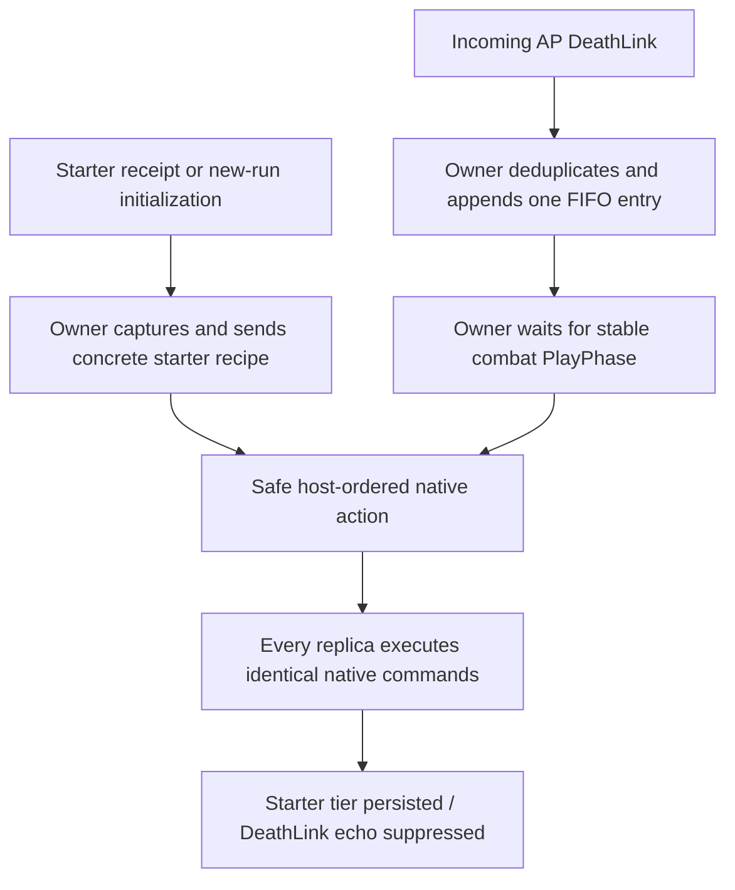

Source: [ProgressiveStarterMultiplayer](/Users/jamsari/PersonalProj/ParallelTasks/Slay-the-Spire-2-Archipelago/client/StS2AP/Utils/Progression/ProgressiveStarterMultiplayer.cs:17), [starter operation application](/Users/jamsari/PersonalProj/ParallelTasks/Slay-the-Spire-2-Archipelago/client/StS2AP/Utils/Progression/ProgressiveStarterMultiplayer.cs:555), [DeathLink queue, admission and owner send](/Users/jamsari/PersonalProj/ParallelTasks/Slay-the-Spire-2-Archipelago/client/StS2AP/Utils/DeathLink/DeathLinkMultiplayer.cs:90), [replicated player-death observer](/Users/jamsari/PersonalProj/ParallelTasks/Slay-the-Spire-2-Archipelago/client/StS2AP/Patches/Lifecycle/Patches_DeathLinkPlayerDeath.cs:12), [DeathLinkEventLedger](/Users/jamsari/PersonalProj/ParallelTasks/Slay-the-Spire-2-Archipelago/client/StS2AP/Utils/DeathLink/DeathLinkEventLedger.cs:8), [beta native damage pipeline](/Users/jamsari/PersonalProj/ParallelTasks/Slay-the-Spire-2-Archipelago/Spire2-Beta-Decompiled%202/MegaCrit/sts2/Core/Commands/CreatureCmd.cs:258).

## 8. Relic rewards, Rewarding Elites, coupons and chests

There are **two contracts**, not one global replacement of native relic RNG:

- **AP-menu standard relics:** owner makes a stable AP choice and publishes its exact model.
- **Natural Elite/chest rewards:** replicas retain native generation and AP receipts determine whether an eligible natural reward survives.

### Singleplayer foundation and first multiplayer implementation

The Rewarding Elites/progressive relic system predates multiplayer: `934923a` on 11 August added the coupon counter; `e1bb3c2` on 13 August integrated Rewarding Elites. The current distinction is between the first configured **X** relic receipts available anytime and later receipts that must pair with a relic coupon gained from a natural relic source. The first ten eligible sources produce numbered AP relic checks and a relic coupon. A waiting gated receipt can keep the natural relic; a coupon without a receipt waits for a later AP-menu pairing. Beyond the AP-controlled range, rewards remain native.

**18 August, `058881c`:** first mirrored multiplayer relic rewards. **19 August, `9b1c64c`:** persist concrete assignments for preview and reuse. **23 August, `a188fe9`:** introduced `StandardRelicPool`, avoiding private advancement of native reward RNG during AP-menu assignment. **24 August, `cc9c77f`:** scarcity chest fix. **28 August, `044ecc6`:** host receipt arbitration and frozen chest decisions. **29 August, `4baf7a5`:** all-replica Proceed barrier. **15 September, `a5d527d`:** broadcast the receipt decision before native generation so host and clients can roll concurrently; retain a delayed recovery request.

### AP-menu relic selection

`GetOrAssignRelicChoices` reuses a saved assignment; in multiplayer it calls `StandardRelicPool.CreateChoices` with **`NetId:itemIndex`**. The pool reads the current native grab bag, excludes owned/reserved/unavailable relics, rolls a stable 50/33/17 rarity distribution, and ranks candidates with SHA-256 over the run seed, character, receipt key, ordinal and candidate ID. It does not advance `PlayerRng.Rewards` while choosing.

The owner serializes the selected relic. Every replica reserves that exact model by removing it from the relevant native grab bags; removal is idempotent. Later native rewards therefore cannot draw a model that only the owner privately removed. Singleplayer still uses its native pull path.

Before a menu materializes relic assignments, `RelicReceiptMultiplayer.ApproveMenu` asks the host to reserve the relevant receipts for the **menu**. `ApRelicReceiptState` prevents the same `NetId + receipt index` from being assigned simultaneously to a chest and a menu. It also preserves the exact menu model and consumed destination independently of later owner snapshots.

This is existing receipt arbitration for relic destinations, not a generic rollback/retry transaction for item grants.

### Natural Elite and Black Star rewards

The client starts with a native reward already generated on each replica. `ProcessNativeRelicReward` records the numbered source and adds its AP check. If a waiting gated receipt can pay for it, the native relic survives and the receipt is consumed; otherwise the native relic is removed and the player gains a relic coupon. Black Star’s appended relic is processed separately so the base Elite relic and extra relic have separate source numbers.

### Chest agreement and the fewer-relics-than-players problem

1. After native room-entry hooks and immediately before `BeginRelicPicking`, the **host freezes** one candidate record per player in the run’s current `Players` order. “Generates treasure” is the result of `Hook.ShouldGenerateTreasure` for that player; Silver Crucible and similar effects can make it false. “Source number” is the next numbered AP Relic check. “AP gated” means that source is within the AP-controlled first ten. “Funding receipt” is the exact next unreserved Relic item index available at that moment.
2. The host reserves that receipt to this room key. A relic receipt is otherwise reserved to the AP menu only when its owner opens the menu and asks for approval. `ApRelicReceiptState` serializes those two races: the same `NetId + received item index` cannot belong to both destinations. Late receipts do not rewrite an already-created chest decision.
3. The host **immediately broadcasts the immutable receipt decision before its own `BeginRelicPicking` call**. A client already holding that decision can continue immediately; otherwise it pauses its room-entry hook until the broadcast arrives. This travels outside the native action queue, because room entry may already be awaiting a hook inside that queue; inserting the reply behind it would deadlock.
4. The host and clients can now generate concurrently. Every replica generates **all native candidates first** in native player order, relying on MegaCrit’s multiplayer invariant that synchronized run RNG and equivalent relic bags produce the same ordered models. The ordered subset where `GeneratesRelic` is true maps positionally to MegaCrit’s `_currentRelics` list.
5. Before filtering, each replica locally checks candidate count, saved Player order and `Hook.ShouldGenerateTreasure` shape against the frozen host record. AP no longer publishes or compares the concrete native relic IDs. MegaCrit owns model-list agreement; if native RNG or bag state has already diverged, this AP layer will not detect different models that happen to have the same shape.
6. Replicas remove candidates whose AP-gated source had no frozen receipt. Those relics were already popped from their native bags and remain unavailable there. The player has earned the numbered Relic check and **gains a relic coupon**; a later receipt can spend that coupon through a new deterministic AP-menu relic assignment. This differs from merely hiding a still-available candidate.
7. Remaining candidates form MegaCrit’s one **shared picker list**. The list is shared because the native multiplayer chest lets the players vote over the same remaining choices. A player can win a relic whose survival was funded by another player’s receipt; the funding owner is not an exclusive winner. The numbered AP check and receipt consumption still belong to that candidate’s `PlayerNetId`, not to whoever wins the visible relic.
8. Fewer candidates than players is valid. The scarcity patch changes controller focus from “holder at my player index” to the first visible relic, avoiding an out-of-range assumption.
9. Opening/settling records each frozen numbered source once. If it has a reserved receipt, settlement marks that exact receipt used; otherwise it records the relic coupon. An empty chest completes through the native chest-open animation once.

The candidate decision keeps a 30-second total client wait ceiling; menu approval/reservation waits use 15 seconds. These are timeout ceilings, not intentional fixed delays. The normal chest-entry path is now one host broadcast of the small frozen decision. A client sends a direct recovery request only if that broadcast has not arrived within one second; an already-frozen host decision is sent only to that requester. Early chest clicks are still ignored until the local mask exists. This removes the earlier serialized sequence of host native generation, native-ID broadcast and client verification from the pre-open critical path.

This optimization deliberately moves one responsibility back to the base game. It preserves AP’s authoritative receipt allocation and structural checks, while trusting MegaCrit for the same native RNG/relic-bag invariant its shared vote-index protocol already requires. The tradeoff is reduced early divergence detection: the removed relic-ID sentinel could report different concrete candidates before a vote, while the new shape check cannot. C# compilation and state regression tests can validate the protocol change, but only two-client runtime tests with matching and deliberately stressed relic-bag state can validate that trust boundary.

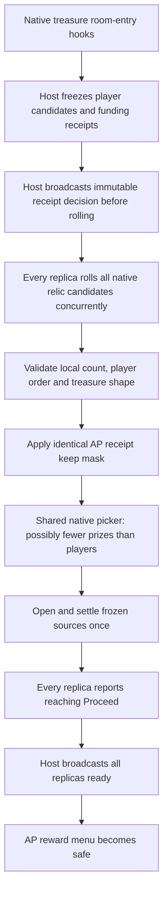

### Why AP menu opening is blocked until everyone finishes

The precise rule is stronger than “everyone has clicked the chest”: every replica reports readiness **after its `OpenChest` task finishes**, and the host broadcasts all-ready only after the entire run roster has reported it. This barrier does not keep the vote open and does not wait for the AP server. It covers the chest animation/selection completion and `DoExtraRewardsIfNeeded`, which can construct one native `RewardsSet` per player at different times on different machines.

Treasure extra rewards can construct native `RewardsSet`s at different times on different replicas. If one machine inserts an AP set before completing that native sequence while another inserts it afterward, the same native reward-set number can identify different sets. Sending an index for “the same overall effect” cannot fix that mismatch. Current UI guards also reject opening during another card/relic choice, combat or travel, and recheck after awaits.

Two freezes solve different problems: **run settings** keep receipt availability rules stable; **chest decisions** keep this chest’s funding stable. The **Proceed barrier** keeps native reward-set construction order stable.

Source: [RelicRewardUtility](/Users/jamsari/PersonalProj/ParallelTasks/Slay-the-Spire-2-Archipelago/client/StS2AP/Utils/Rewards/RelicRewardUtility.cs:37), [StandardRelicPool](/Users/jamsari/PersonalProj/ParallelTasks/Slay-the-Spire-2-Archipelago/client/StS2AP/Utils/Rewards/StandardRelicPool.cs:28), [receipt destination state](/Users/jamsari/PersonalProj/ParallelTasks/Slay-the-Spire-2-Archipelago/client/StS2AP/Persistence/ApRelicReceiptState.cs:59), [menu approval](/Users/jamsari/PersonalProj/ParallelTasks/Slay-the-Spire-2-Archipelago/client/StS2AP/Persistence/ApRelicReceiptState.cs:98), [freeze and pre-generation broadcast](/Users/jamsari/PersonalProj/ParallelTasks/Slay-the-Spire-2-Archipelago/client/StS2AP/Multiplayer/RelicReceiptMultiplayer.cs:196), [native candidate filtering](/Users/jamsari/PersonalProj/ParallelTasks/Slay-the-Spire-2-Archipelago/client/StS2AP/Patches/Rewards/Patches_InjectAPRewards.cs:357), [beta native picker](/Users/jamsari/PersonalProj/ParallelTasks/Slay-the-Spire-2-Archipelago/Spire2-Beta-Decompiled%202/MegaCrit/sts2/Core/Multiplayer/Game/TreasureRoomRelicSynchronizer.cs:89), [scarcity focus](/Users/jamsari/PersonalProj/ParallelTasks/Slay-the-Spire-2-Archipelago/client/StS2AP/Patches/Rooms/Patches_TreasureRoomRelicScarcity.cs:20), [AP menu chest guard](/Users/jamsari/PersonalProj/ParallelTasks/Slay-the-Spire-2-Archipelago/client/StS2AP/UI/ArchipelagoRewardUI.cs:367).

## 9. AP card rewards: the longer history

### What the history confirms

| Stage | Evidence | Design and pressure for change |
| --- | --- | --- |
| Final selected-card sync considered | 17–19 Aug design/RFC/roadmap | `SyncLocalObtainedCard` could transfer an obtained card, but not automatically represent generation effects, skip/sacrifice, rerolls or multiple selections. This audit found design evidence, not a separately committed earlier chosen-card-only implementation. |
| Replica-native population | **18 Aug, `058881c`** | New recipes called native `CardReward.Populate` on replicas, then synchronized choices. Reliance on native mutable RNG/odds and generation timing made AP’s private/deferred lifecycle difficult. |
| Owner-final offers | **20 Aug, `8839a14`** | Owner materialized stable offers and sent serialized final cards in the full menu. Visible cards matched, but remote replicas bypassed generation-time side effects. |
| Explicit Silken Tress fix | **26 Aug, `44f2a05`** | Sent a consumed-Tress marker and applied its callback remotely. The commit’s source explains the concrete failure: Glam cards existed remotely while only the owner’s Tress became used. |
| AP RNG + selected native hooks + explicit effects | **29 Aug, `32aa30c`** | Owner-final AP-RNG strategy coexisted with a strict replica-native strategy. A reviewed hook whitelist bounded native behavior; explicit before/after effects propagated Tress and Crucible state. |
| First-reveal lifecycle | **8 Sep, `f63716d`** | Menu browsing stopped generating card offers and consuming generation effects. Offers materialized only when opening their card picker. |
| AP RNG + full native hooks on every replica | **8 Sep, `24bd923`** | Removed the hook whitelist and explicit effect replay from the card path. Every replica generated the offer and executed native modifier callbacks, then verified agreement before picker choice. |
| Focused offer verification | **9 Sep, `6a055d2`** | Removed broad before/after native-player state from the digest. Verify receipt and ordered offered cards; leave general run-state checks to native checksums. |
| Cleanup of obsolete machinery | **14 Sep, `3bbf26e`** | Removed leftover reward-effect and legacy restoration machinery. The current source no longer has the old explicit card-effect contract. |

The correction to “we first synced the final card” is therefore: an early selected-card-only approach was considered, while the clearly committed intermediate implementation sent **the final offer**, not merely the selected card. The Tress/Glam failure is explicitly documented in its corrective commit.

### The exact current RNG recipe

“Our own RNG” means our own **seed ownership and isolated stream**. Card/potion generation still uses MegaCrit’s `Rng` type and native factories; it is not a wholesale custom PRNG or custom card generator.

`CreateApRewardRng` constructs this seed material:

```text
sts2ap-reward-rng-v1
| domain                 # "card" or "potion"
| native run StringSeed
| AP slot ID
| native player slot index
| AP character number/offset
| AP received item index
```

It SHA-256 hashes the UTF-8 string and uses the first four bytes as a little-endian 32-bit seed. The supported public/beta APIs use that same seed value despite differing constructor widths.

**NetId is not in this card seed.** It identifies the owner in the network/spec/cache/digest. **Selected AP Player Number is not an explicit seed field either**; it controls numbered AP item/location ownership. Native player slot index, AP slot ID and AP character are distinct concepts.

The assigned reward act and rare/regular flag are recipe inputs affecting generation, even though they are not fields in the seed string. Deterministic reproduction also requires matching card pools, relic/model state, configuration and callback order. Seed + receipt alone cannot recreate an already revealed offer after those inputs change; that is why final revealed offers are still saved.

### The rarity/pity tradeoff

The AP-local `RollForRarity` patch bypasses native persistent rarity odds for these scoped rolls:

| AP reward | Common | Uncommon | Rare |
| --- | --- | --- | --- |
| Regular | 57% | 37% | 6% |
| Regular under Scarcity | 60% | 37% | 3% |
| Rare reward | 0% | 0% | 100% |

Rarity rolls are independent of native pity progression. The factory still handles actual card pools, duplicate filtering, player-count restrictions, allowed-rarity fallback, upgrades and normal model hooks. Non-rare upgrade odds use the assigned act, then native modifiers; AP RNG is attached for applicable random rolls. This is a narrow replacement of problematic mutable inputs, rather than reimplementing the entire factory.

### Current lifecycle, step by step

1. **Build outer AP menu:** send an immutable menu recipe. A new card row has rarity/act/receipt identity and strategy `ap_rng_replicated_card_v1`, but no generated cards.
2. **Open that card row:** the per-player AP selection queue waits for earlier AP selections and awaited callbacks. For example, obtaining Tress before revealing a card must finish in that order on each replica.
3. **Reserve choice IDs:** reserve verification and first-picker IDs before generation callbacks can await. This keeps native choice counters aligned.
4. **First reveal on every replica:** use the receipt-local AP RNG with `CardFactory.CreateForReward`. Defer the factory’s fire-and-forget option-hook launch, invoke `Hook.TryModifyCardRewardOptions` once explicitly, then await `Hook.AfterModifyingCardRewardOptions`.
5. **Verify:** every replica serializes its ordered cards. The owner sends a SHA-256 digest through `PlayerChoiceSynchronizer`; remote replicas compare their own result. Object property order is canonicalized; array order stays significant because picker choices are indexes.
6. **Install and persist:** save the revealed offer, reveal marker, act/rarity and reroll state. Only the owner publishes its AP assignment progress; replicas retain their corresponding runtime reward.
7. **Native picker/claim:** MegaCrit synchronizes selection and native reward alternatives, then performs native deck-add callbacks. The owner consumes the AP receipt at successful completion. Plain skip/close leaves it claimable.
8. **Reopen:** reuse assigned cards. Refresh only eligible Molten/Toxic/Frozen Egg hooks for unupgraded choices; do not rerun Tress, Crucible or general generation. Detaching `RelicObtained` prevents broad automatic refreshes but does not remove claim-time native deck-add effects.
9. **Save/load:** restore the revealed serialized offer and native relic state together, without replaying generation callbacks.

```mermaid
sequenceDiagram
    participant O as Owner UI and replica
    participant R as Remote replicas
    participant N as Native choice synchronizer
    O->>R: Immutable menu with unrevealed card recipe
    Note over O,R: No card generation while browsing outer menu
    O->>N: Select AP card reward row
    N->>R: Matching reward selection
    Note over O,R: Queue prior AP callbacks; reserve verification and picker IDs
    O->>O: Generate with AP RNG; execute native hooks
    R->>R: Generate with same AP RNG; execute native hooks
    O->>N: Digest of receipt and ordered final offer
    N->>R: Owner verification choice
    R->>R: Verify locally generated offer
    Note over O,R: Install offer; owner persists assignment progress
    O->>N: Native card or alternative selection
    N->>R: Execute same selection and native callbacks
    O->>O: Consume AP receipt on successful completion
```

A failed digest prevents applying the picker choice and invalidates further AP claims. Generation hooks have already run by that point: this is **not** an atomic rollback of those hooks. Native checksum agreement remains necessary for general run state.

The deterministic AP stream described here is specifically the first-materialization path. Current `ApDeferredCardReward.Populate` enables **native rerolls** after opening; it delegates to `base.Populate`. Do not present all later rerolls as reseeding from the same AP first-offer recipe.

### Pael’s Wing, Glam and Wing Charm

- **Pael’s Wing is a card-reward alternative.** Its native Sacrifice action completes the reward without adding a card, increments the sacrifice counter, and periodically grants a native relic. A protocol carrying only an obtained card cannot represent that action. The current native picker/alternative synchronization executes it on all replicas; completing the alternative consumes the AP reward.
- **Glam is an enchantment applied by Silken Tress**, not a separate relic. The important hidden state is Tress becoming used when its generation modifier runs. Current replicated native hooks apply both the card modification and callback state on each machine.
- **Wing Charm uses random choice during card modification.** `158a72b` on 26 August excluded it from AP multiplayer. AP-local Swift-enchantment RNG routing exists in the current card patches, but **`Patches_WingCharmMultiplayer` still excludes Wing Charm from multiplayer pools**. Its explanatory comment still describes the older owner-only card path. This audit does not claim the exclusion has been lifted.
- **Silver Crucible** illustrates both card counter effects and treasure-generation hooks. The available beta reference itself restricts its normal availability to singleplayer. Historical compatibility handling is not evidence that the current multiplayer pool normally includes it.

Source: [CreateApRewardRng / GenerateCardChoices](/Users/jamsari/PersonalProj/ParallelTasks/Slay-the-Spire-2-Archipelago/client/StS2AP/Utils/Rewards/ApMirroredRewardDispatcher.cs:609), [rarity and RNG patches](/Users/jamsari/PersonalProj/ParallelTasks/Slay-the-Spire-2-Archipelago/client/StS2AP/Patches/Rewards/Patches_APCardRewardUpgradeOdds.cs:168), [PrepareCards and claim](/Users/jamsari/PersonalProj/ParallelTasks/Slay-the-Spire-2-Archipelago/client/StS2AP/Utils/Rewards/ApMirroredRewardDispatcher.cs:1097), [digest codec](/Users/jamsari/PersonalProj/ParallelTasks/Slay-the-Spire-2-Archipelago/client/StS2AP/DomainAdapters/ApCardRevealCodec.cs:15), [selection ordering](/Users/jamsari/PersonalProj/ParallelTasks/Slay-the-Spire-2-Archipelago/client/StS2AP/Patches/Rewards/Patches_APRewardSelectionOrder.cs:15), [reopen lifecycle](/Users/jamsari/PersonalProj/ParallelTasks/Slay-the-Spire-2-Archipelago/client/StS2AP/Utils/Rewards/ApCardRewardLifecycle.cs:15), [Wing Charm exclusion](/Users/jamsari/PersonalProj/ParallelTasks/Slay-the-Spire-2-Archipelago/client/StS2AP/Patches/Rewards/Patches_WingCharmMultiplayer.cs:15).

## 10. Bonus Wax Relics

**8 September local time, `759a17b`:** upstream added bonus-item definitions and wax rewards. **9 September, `64b01d3`:** integrated them with multiplayer mirrored rewards. **10 September, `cad9e17`:** salted random rankings by native player slot.

Why this is easier than standard relics: bonus wax receipts do not need to compete with a natural Elite/chest source. There is no relic-coupon or chest-destination arbitration.

`BonusRewardUtility.GetOrAssign` first reuses a saved assignment. Otherwise it counts earlier same-item receipts to determine the bonus definition ordinal, reads that player’s frozen bonus settings, and resolves an explicit relic or ranks eligible configured-pool candidates deterministically. Pickup-effect relics are rejected by the resolver used here.

Random ranking material is:

```text
sts2ap-bonus-relic-v1|runSeed|WAX_RELIC:ordinal|PLAYER_SLOT:n|candidateRelicId
```

The player-slot component is present only during real multiplayer. It changes random rankings, not explicit configured relics or persisted assignments; two rankings can still choose the same relic. The owner marks the model `IsWax`, saves its serialized assignment by receipt index, and the mirrored menu grants that exact relic through the native relic reward wrapper.

Wax lifetime is also replicated: after native combat-end hooks, AP tracks cadence per `NetId` and melts the first available unmelted wax relic after three combats. Native Toy Box melting is suppressed for AP players whose bonus wax configuration is managed, avoiding duplicate melting. Cadence resets when no wax is available and is saved with per-player run state.

If the multiplayer BonusItems capability is disabled, the code has the established gold-conversion path instead. It is enabled in the audited current capability set.

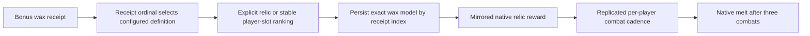

Source: [BonusRewardUtility](/Users/jamsari/PersonalProj/ParallelTasks/Slay-the-Spire-2-Archipelago/client/StS2AP/Utils/Rewards/BonusRewardUtility.cs:18), [BonusRewardSelectionKey](/Users/jamsari/PersonalProj/ParallelTasks/Slay-the-Spire-2-Archipelago/client/StS2AP/Utils/Rewards/BonusRewardSelectionKey.cs:10), [wax cadence patches](/Users/jamsari/PersonalProj/ParallelTasks/Slay-the-Spire-2-Archipelago/client/StS2AP/Patches/Rewards/Patches_WaxRelics.cs:27).

## 11. Universal buffs converted to gold

**24 August, `83adfd9`:** converted multiplayer universal combat buffs to five raw AP gold **for every configured character**, rather than implementing their combat effects. **29 August, `38974b9`:** corrected the multiplication: each buff contributes five to a cumulative total divided equally across the configured characters.

For `C` distinct configured characters, `B` prior converted buffs, and `K` new buffs, each character receives this increase in whole-gold share:

```text
floor(5 × (B + K) / C) − floor(5 × B / C)
```

This retains fractions through the cumulative count. For three characters, successive buffs add **1, then 2, then 2** gold to each character’s bank. After three buffs each has five; processing all three at once gives the same result. Character count comes from the slot configuration, not the number of live native players in this run.

The conversion is owner AP bookkeeping. Actual wallet gain uses the same aggregate native gold reward and cursor as section 2, including Poverty handling. Rebuilding from AP history counts eligible owned receipts and reproduces the cumulative bank. Numbered-player ownership is resolved before universal/character-specific item decoding; universal IDs are not treated as character-offset items.

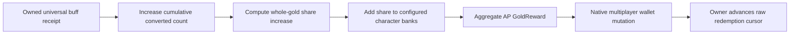

Source: [UniversalBuffGold](/Users/jamsari/PersonalProj/ParallelTasks/Slay-the-Spire-2-Archipelago/client/StS2AP/Utils/Rewards/UniversalBuffGold.cs:15), [rebuild and conversion](/Users/jamsari/PersonalProj/ParallelTasks/Slay-the-Spire-2-Archipelago/client/StS2AP/Utils/Rewards/ApGrantDispatcher.cs:20), [numbered-player ID codec](/Users/jamsari/PersonalProj/ParallelTasks/Slay-the-Spire-2-Archipelago/client/StS2AP/Data/ArchipelagoIdCodec.cs:12).

## Other areas worth mentioning in a presentation

| Area | Why it belongs in this syncing story |
| --- | --- |
| Owner-only AP check writing | Backend reward/rest actions run everywhere, but only the responsible connection queues the AP location. Effective queued/checked progress must be published so all replicas construct future options consistently. |
| Replica construction counters | Owner progress and each machine’s native generation cursor advance at different times. Keeping them separate prevents off-by-one location/reward construction. |
| AP selection ordering | Native reward selection handlers start async tasks. Per-player AP ordering preserves awaited relic callbacks before the next card reveal, without forcing nested native rewards into the same queue. |
| Travel and lifecycle guards | Closing/reopening or awaiting approval can span a room transition. Lifecycle checks reject stale menu work and finish native picker skip before tearing down UI. |
| Shared-slot Player Number | A direct AP connection can share a slot while owning only its numbered item/location block. This differs from both native NetId and native player slot index. |
| Start-of-act Ancients and Ascension | Ancient choices and shared Ascension rules have their own replicated construction boundaries; they are not ordinary received relic rows. Initial multiplayer support appears in `d7a87eb` on 21 Aug and `52a825e` on 24 Aug respectively. |

## Validation and limits

**Performed:** current-source tracing; historical source/diff inspection; author-time comparison; inspection of preserved pre-squash history; current API-target check; client regression suite (**289 passed, 3 packaging tests skipped**); DLL-only Release compilation for both supported targets (`0.107.1` and `0.111.0`); artifact source-link validation; `git diff --check` and final working-tree inspection.

**Not run:** APWorld generation/tests, loader verification, singleplayer gameplay, two-client gameplay or reconnect/crash reproduction. The chest and DeathLink protocols changed at runtime, so successful state tests and C# builds do not prove matching native relic state, FIFO delivery timing, mitigation behavior or lethal echo suppression between two live clients. Historical “working” messages are attributed to the developer/commit and are not fresh proof from this audit.

Only `Spire2-Beta-Decompiled 2/` was available as a local decompiled reference. Its Pael’s Wing, Tress, Crucible, card-factory, damage pipeline and rest/chest lifecycle code was used as **beta static evidence**. There was no matching public decompilation here; beta source is not proof of public runtime behavior. The supported project targets were checked separately.

A compact in-game follow-up matrix would be:

| Scenario | Expected result or useful log |
| --- | --- |
| Rest sites with different players’ unlock/check state | Correct owner-specific action lists; one writer per AP check; `Applied AP rest-site options for player ...` |
| Gold and full potion inventory | Matching wallets; potion remains assigned/claimable until a slot exists |
| AP shop page on a non-host owner | Only that owner sees and writes its checks; buying a fake entry synchronizes the gold loss and Courier does not restock it |
| Two direct connections to one AP slot | Independent NetId consumption and correct numbered-player item ownership |
| Delayed AP progress and room entry | No replica construction counter skips; wrong-baseline delta is rejected rather than applied |
| Chest with zero, one, or fewer prizes than players | Native empty completion once; valid shared selection and controller focus; `Treasure AP decision frozen ...` |
| One replica finishes the chest slowly | AP menu blocked until `All replicas reached treasure Proceed; AP rewards are safe ...` |
| Obtain Tress, reveal one card row, skip/reopen | Matching Glam offers and used state; outer menu browsing consumes no generation effect; `Prepared replicated AP card offer ...` |
| Pael’s Wing sacrifice | Matching sacrifice counter/native relic grant and one consumed AP reward, even with no selected card |
| Egg acquired after an offer was revealed | Eligible assigned choices refresh without rerolling or replaying one-shot generation effects |
| Save/rejoin with revealed offers, coupons, starters and wax | Restore the selected host snapshot’s native/AP state, exact offers and per-player cadence |
| DeathLink in a shop, event, map room or combat transition | No immediate HP change; event remains queued until a stable combat player phase |
| Two DeathLinks queued five seconds apart while combat stays in PlayPhase and the target survives | Two ordered managed actions and two damage attempts; no coalescing or duplicate outward echo |
| First queued DeathLink kills the target | The later entry is not transferred to another player; it may stay queued until run teardown clears it |
| DeathLink with Block, Buffer, Intangible and death prevention | Block is bypassed; Buffer/Intangible/death prevention modify the result identically on both clients; native damage feedback plays |
| Ordinary host and client deaths | Each dead player’s local process sends exactly one AP DeathLink after native death prevention; other replicas remain silent |

To inspect a historical entry locally, use `git show <hash>` or `git show <hash>:<historical-path>`. Files moved between `Utils/`, `Multiplayer/`, `Persistence/` and feature folders over this history, so a current-path-only log is insufficient.
